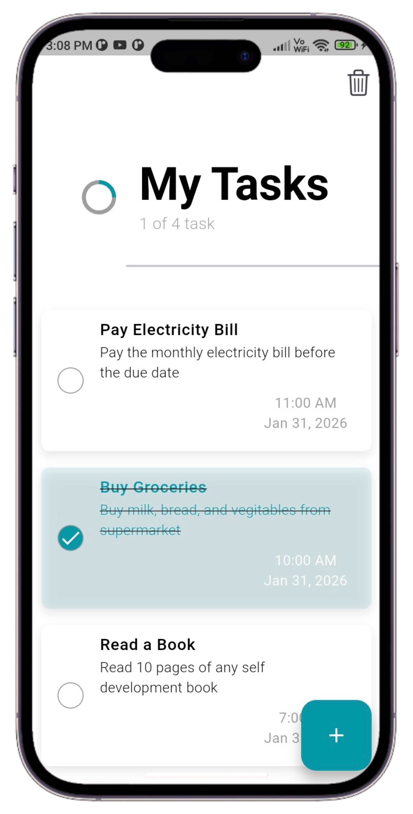
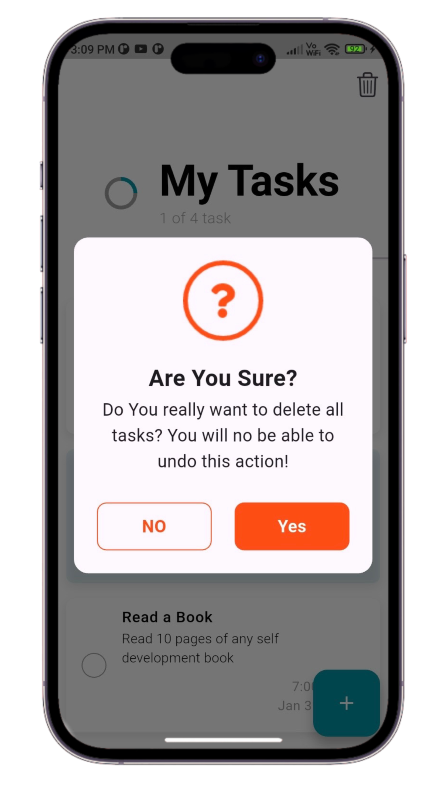

# 📝 ToDo Application

A simple task management app built with Flutter.  
Users can add, update, and delete tasks easily.  
Data is stored locally using Hive database.

---

## 📸 Screenshots

| Home | Add Task | Edit Task | Delete All Tasks | 
|------|----------|-----------|-----------|
| | add_your_ss_here | add_your_ss_here | |

---

## 🚀 Features

- ➕ Add new tasks  
- ✏️ Update tasks  
- 🗑 Delete tasks  
- 📦 Data stored using Hive (local database)  
- 🔄 Auto UI update using ValueListenableBuilder  
- ⚡ Works fully offline  
- ✅ CRUD operations implemented

---

## 🛠 Tech Used

- Flutter  
- Dart  
- Hive Local Database  
- ValueListenableBuilder (State Management)

---

## 📥 Download App

This app is hosted on Play Store:  
👉 https://play.google.com/store/apps/details?id=com.ticktick.task&pcampaignid=web_share

---

## 👨‍💻 Developer

Author: Anandu Udayan  
Email: anandhuudayan180@gmail.com
